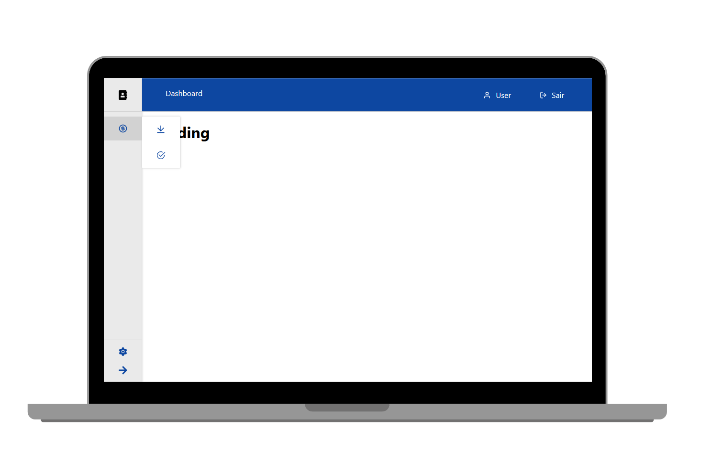

<h1 align="center">
    <br>Dashboard Web<br/>
    ReactJS
</h1>

<p align="center">
  <a href="#bookmark-sobre">Sobre</a>&nbsp;&nbsp;&nbsp;|&nbsp;&nbsp;&nbsp;
  <a href="#rocket-tecnologias">Tecnologias</a>&nbsp;&nbsp;&nbsp;|&nbsp;&nbsp;&nbsp;
  <a href="#boom-como-executar">Como Executar</a>&nbsp;&nbsp;&nbsp;|&nbsp;&nbsp;&nbsp;
  <a href="#memo-licença">Licença</a>
</p>

<p align="center">
  
<p>

## :bookmark: Sobre

O **Dashboard** é uma aplicação Web feita para controle de atividade rotineiras administrativas.
  
Essa aplicação foi realizada **para aperfeiçoar os conhecimento na stack**.

## :rocket: Tecnologias

-  [Typescript](https://www.typescriptlang.org/)
-  [ReactJS](https://reactjs.org/)

## :boom: Como Executar

- ### **Pré-requisitos**

  - É **necessário** possuir o **[Node.js](https://nodejs.org/en/)** instalado no computador
  - É **necessário** possuir o **[Git](https://git-scm.com/)** instalado e configurado no computador
  - Também, é **preciso** ter um gerenciador de pacotes seja o **[NPM](https://www.npmjs.com/)** ou **[Yarn](https://yarnpkg.com/)**.

1. Faça um clone do repositório:

```sh
  $ git clone https://github.com/ggaj/Dashboard-Web.git
```

2. Executando a Aplicação:

```sh
# Aplicação web
  $ cd web
  # Instalando as dependências do projeto.
  $ yarn # ou npm install
  # Inicie a aplicação web
  $ yarn start # ou npm start
```


## :memo: Licença

Esse projeto está sob a licença MIT. Veja o arquivo [LICENSE](LICENSE.md) para mais detalhes.

---